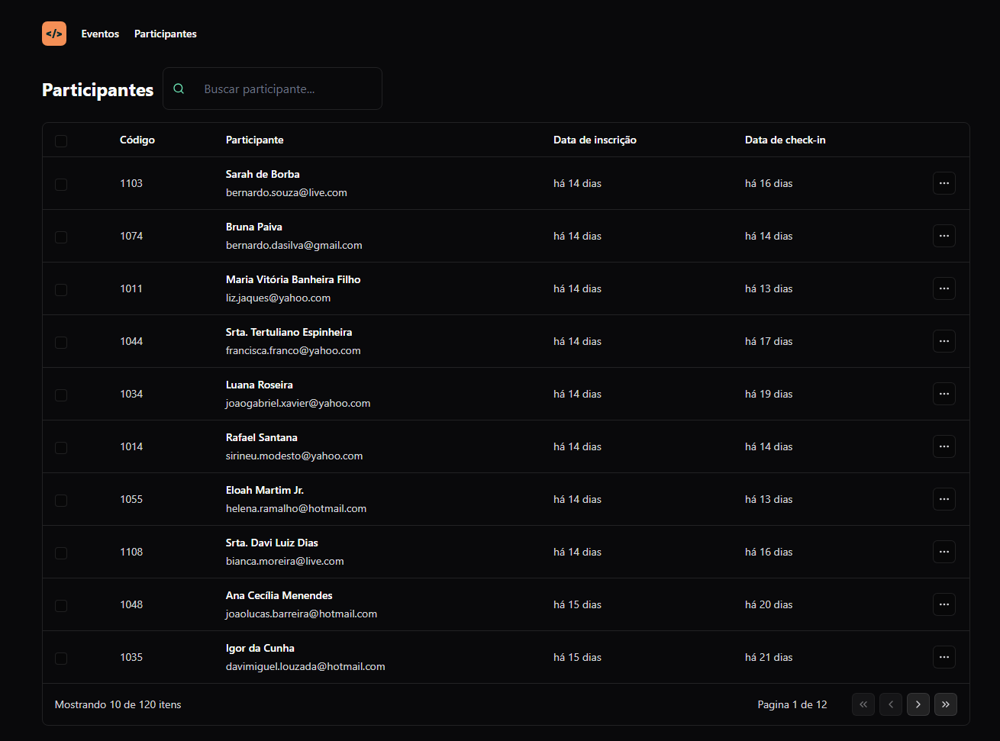
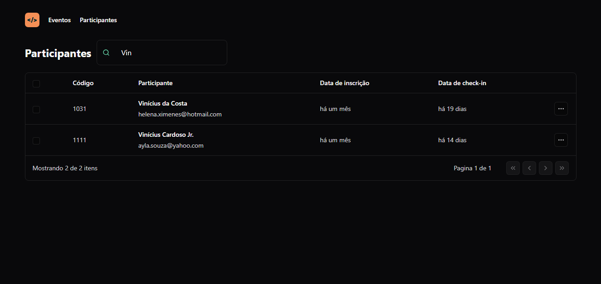
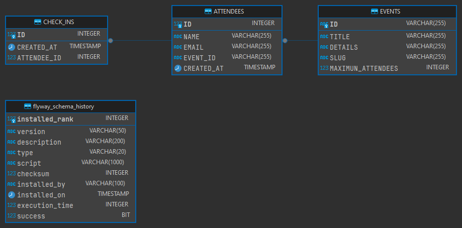
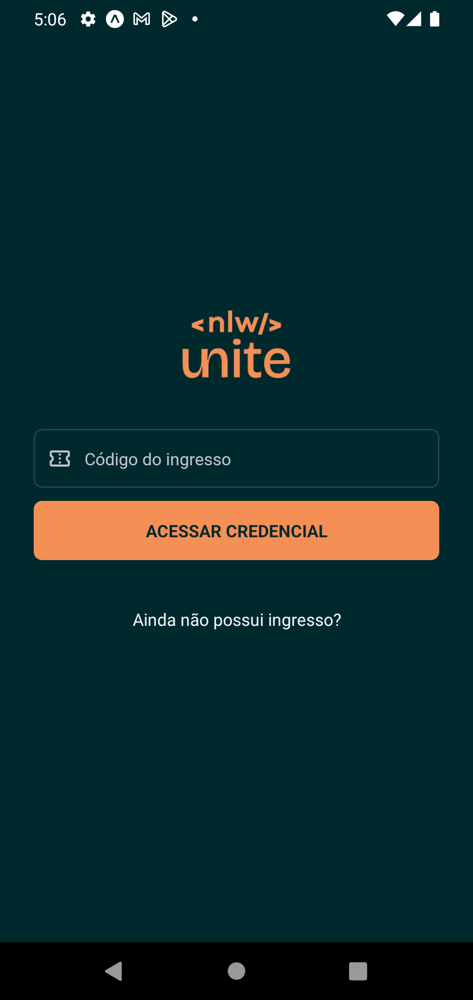
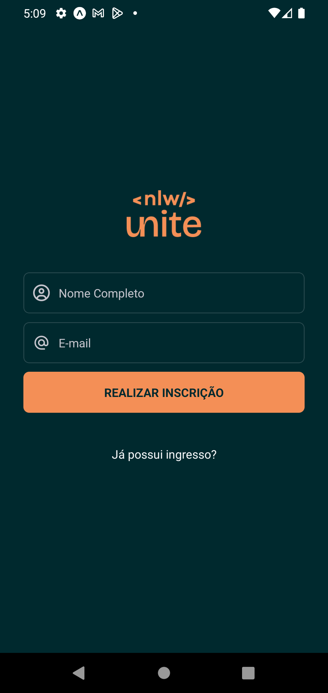
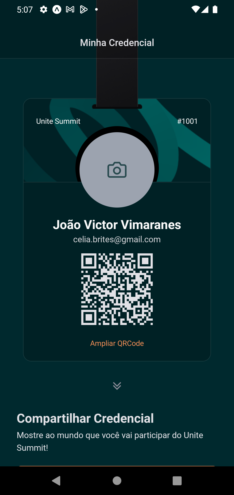
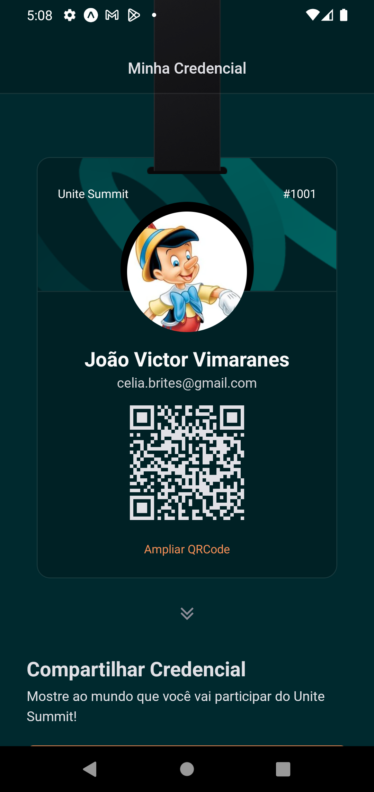
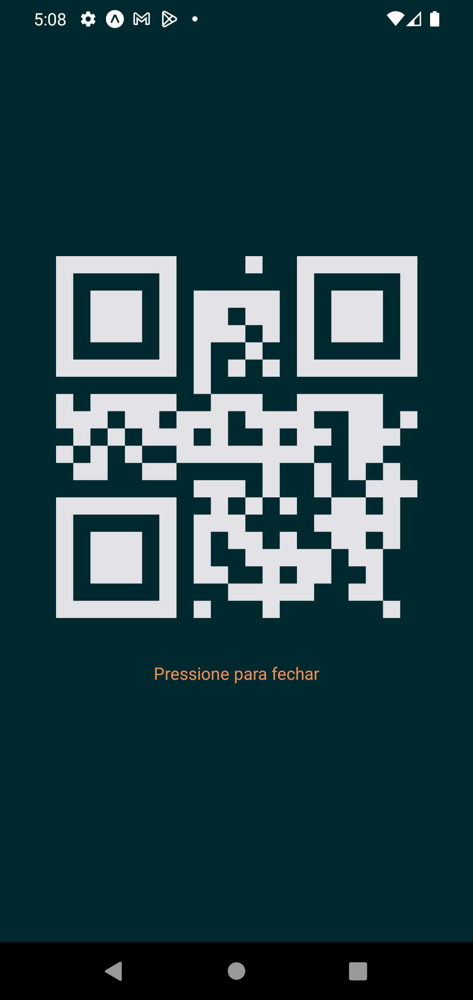

<h1 align="center"> NLW Unite </h1>

Evento exclusivo e gratuito, promovido pela Rocketseat para ensino de tecnologias Front-end, Back-end e mobile.

  

## 🚀 Tecnologias

Esse projeto foi desenvolvido com as seguintes tecnologias:

- Web
  - React
  - Tailwindcss
  - Typescript
  - Lucide-react
  - dayjs
- Back-end
  - Java 17
  - Spring Boot Framework
  - Spring Validation
  - Spring Doc -> Swagger
  - hsqldb -> database
  - Flyway
  - Rest Assured -> testes
  - H2 Database -> testes
- Mobile
  - React Native
  - Typescript
  - nativewind
  - moti

## 💻 Projeto

O Pass.in é um sistema de check-in para eventos presenciais onde o organizador consegue fazer o controle e gerenciar a lista de participantes e cada pessoa pode gerar sua credencial de acesso ao evento.
Com Java construi o back-end da aplicação, em React o painel de controle e em React Native a versão mobile do projeto.

## 🖼 ScreenShot Web

  
  

## Diagrama Entidade-Relacionamento

  

## 🖼 ScreenShot Mobile

  
  
  
  
  

## 📝 Licença

Esse projeto está sob a licença MIT.
